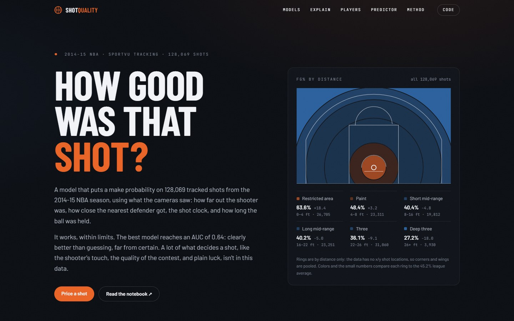
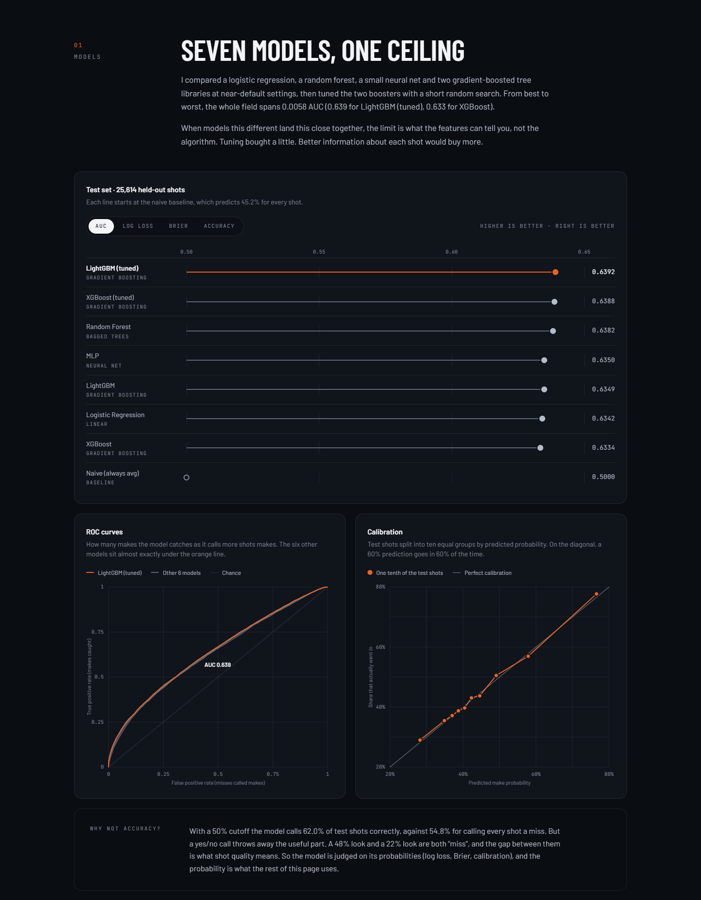
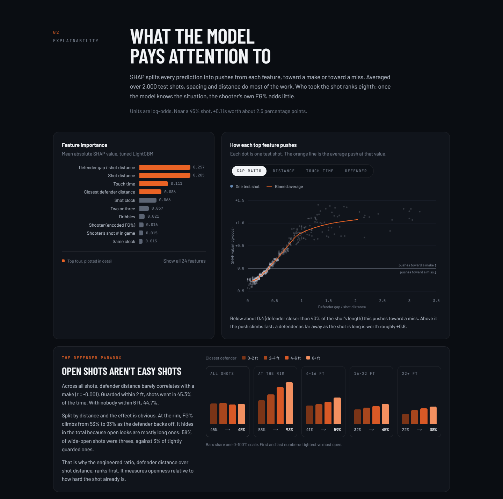
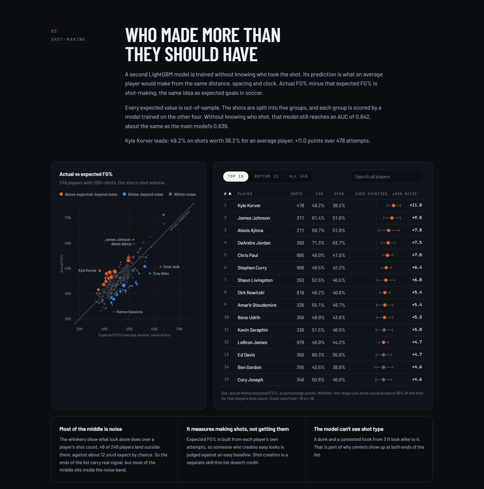
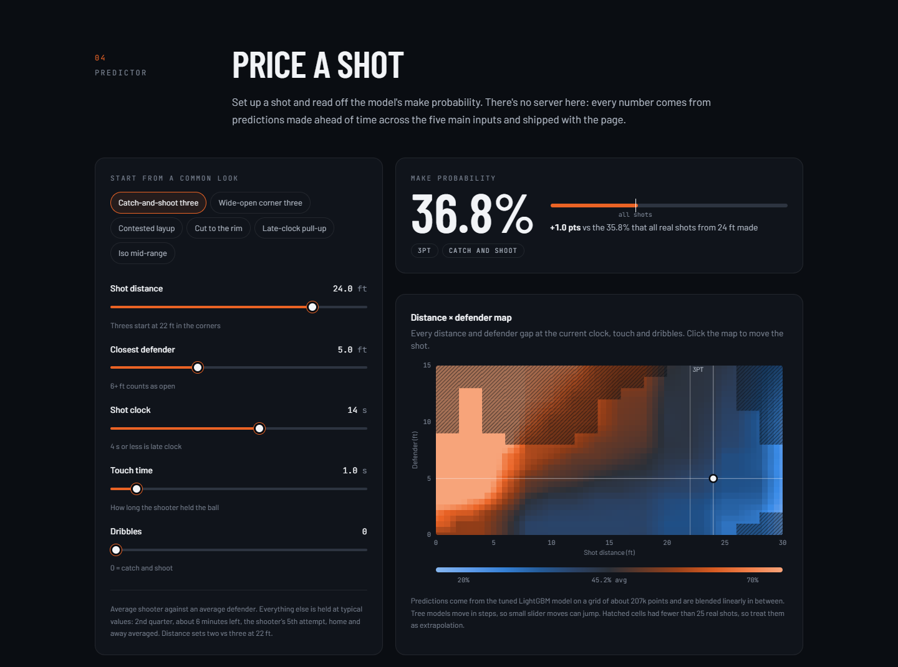
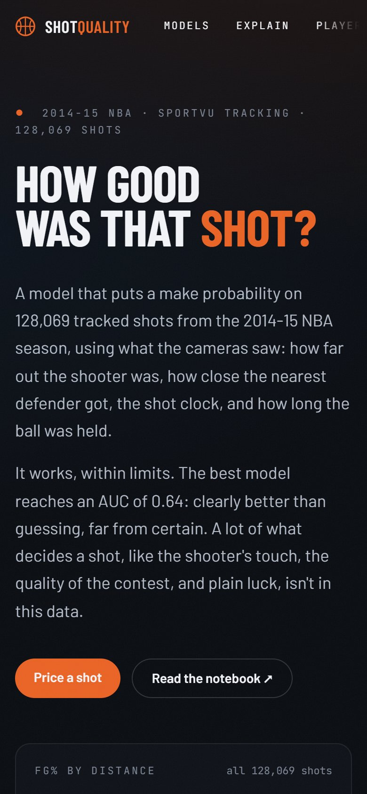
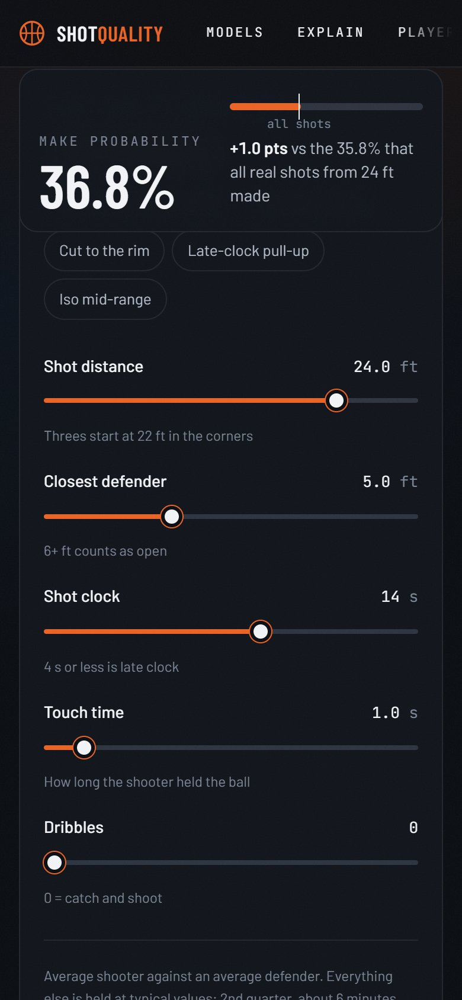

# NBA Shot Quality

An expected field goal model for the 2014-15 NBA season. It estimates the chance a shot goes in from SportVU tracking data: shot distance, closest defender distance, shot clock, dribbles and touch time. The repo holds the analysis notebook, a Python package that reproduces it, and a static website that presents the results.

**Live site:** https://nba-shot-quality-model.vercel.app



## Results

128,069 shots, stratified 80/20 split, scored on the 25,614 held-out shots.

| Model | AUC | Log loss | Brier | Accuracy |
|---|---|---|---|---|
| **LightGBM (tuned)** | **0.6392** | **0.6476** | **0.2288** | **0.6201** |
| XGBoost (tuned) | 0.6388 | 0.6478 | 0.2289 | 0.6195 |
| Random Forest | 0.6382 | 0.6486 | 0.2292 | 0.6186 |
| MLP | 0.6350 | 0.6525 | 0.2307 | 0.6180 |
| LightGBM | 0.6349 | 0.6495 | 0.2297 | 0.6161 |
| Logistic Regression | 0.6342 | 0.6546 | 0.2315 | 0.6155 |
| XGBoost | 0.6334 | 0.6497 | 0.2298 | 0.6169 |
| Naive (always predicts 45.2%) | 0.5000 | 0.6886 | 0.2477 | 0.5479 |

What the numbers say:

- **The signal is real but modest.** The best model cuts log loss by 5.9% and Brier score by 7.7% compared with always guessing the league average. An AUC of 0.64 separates good looks from bad ones, but any single shot is still close to a coin flip.
- **The algorithm barely matters.** Seven very different models land within 0.006 AUC of each other. The limit is the information in the features, not the model.
- **The probabilities are well calibrated.** Across ten bins of predicted probability, the actual make rate tracks the prediction closely, so the output can be read as an expected FG%.
- **Openness relative to distance matters most.** The top SHAP feature is an engineered ratio, defender distance / (shot distance + 1), ahead of shot distance, touch time and raw defender distance. On its own, raw defender distance has almost no correlation with makes (r = -0.001), because open shots tend to be long shots. Within any distance band, though, FG% climbs steadily as the defender backs off.
- **Knowing the shooter adds little** once the situation is known. The shooter's encoded FG% ranks 8th of 24 features.

### Shot-making over expected

A second model, trained without the shooter's identity, gives each shot an expected make probability. The predictions are out-of-fold, so every expected value is out-of-sample: 5-fold cross-validation, with each shot scored by a model trained on the other four folds. Without the shooter, that model still reaches an AUC of 0.642. Actual minus expected FG% measures shot-making (players with 200+ shots). The ± column is the 95% range that luck alone would produce for that shot count.

| Player | Shots | FG% | xFG% | Over expected | Noise band |
|---|---|---|---|---|---|
| Kyle Korver | 478 | 49.2 | 38.2 | +11.0 | ±4.3 |
| James Johnson | 311 | 61.4 | 51.6 | +9.8 | ±5.3 |
| Alexis Ajinca | 211 | 59.7 | 51.9 | +7.8 | ±6.5 |
| DeAndre Jordan | 393 | 71.3 | 63.7 | +7.5 | ±4.5 |
| Chris Paul | 885 | 48.0 | 41.0 | +7.0 | ±3.2 |
| ... | | | | | |
| Nerlens Noel | 444 | 44.4 | 52.7 | -8.3 | ±4.4 |
| Joakim Noah | 340 | 43.8 | 53.1 | -9.3 | ±5.1 |
| Tony Allen | 358 | 48.0 | 58.2 | -10.2 | ±4.8 |
| Ramon Sessions | 219 | 32.9 | 43.9 | -11.0 | ±6.4 |
| Omer Asik | 300 | 50.7 | 62.5 | -11.8 | ±5.3 |

46 of 248 players fall outside their noise band, where about 12 would by chance. The ends of the list carry real signal; the middle mostly doesn't.

### Limits

- AUC 0.64 is modest. Shot quality is noisy, and PCA shows made and missed shots overlapping almost everywhere.
- The data has no x/y shot location, shot type, play type or help defense. Closest defender is measured only at the moment of the shot.
- It covers one partial season (October 2014 to early March 2015).
- The leaderboard measures making shots, not creating them. A player who gets easy looks is judged against an easy baseline.

## Screenshots

| Model comparison | Explainability |
|---|---|
|  |  |
| **Shot-making leaderboard** | **Shot predictor** |
|  |  |

<p>
  
  
</p>

## Repo layout

```
notebooks/nba_shot_quality.ipynb   analysis record: EDA, PCA/t-SNE, models, tuning, SHAP, players
data/shot_logs.csv                 raw Kaggle shot logs (16 MB)
src/shot_quality/                  python package ported from the notebook
  config.py                        feature lists, search grids, notebook reference numbers
  data.py                          loading and cleaning
  features.py                      feature engineering, out-of-fold target encoding, model matrices
  train.py                         baselines, random search, tuned models, situation model
  evaluate.py                      metrics, ROC/calibration curves, threshold sweep, SHAP
  players.py                       shot-making over expected, display name fixes
scripts/export_site_data.py        trains once, checks parity with the notebook, writes site JSON
web/                               Next.js site (static export)
  src/data/*.json                  exported results, imported at build time
  public/data/predictor_grid.json  207,360 precomputed predictions for the predictor
docs/screenshots/                  README images
```

## Setup

### Python

Python 3.12+ (developed on 3.13; the pinned numpy and shap need 3.12).

```bash
python -m venv .venv
source .venv/bin/activate          # windows: .venv\Scripts\activate
pip install -r requirements.txt    # also installs the shot_quality package in editable mode

python scripts/export_site_data.py         # full run with the random search, about 30 s
python scripts/export_site_data.py --fast  # reuse the notebook's best params
```

The export prints a parity table against the numbers recorded in the notebook, then writes JSON into `web/src/data/` and `web/public/data/`. To rerun the notebook, open `notebooks/nba_shot_quality.ipynb` with the `.venv` kernel (`ipykernel` is included). It runs from either the repo root or the `notebooks/` folder.

### Website

Node 20.9+.

```bash
cd web
npm install
npm run dev       # http://localhost:3000
npm run build     # static export to web/out
npm run preview   # serve web/out locally
```

## Deploy on Vercel

1. Push the repo to GitHub and import it in Vercel.
2. Set **Root Directory** to `web`. Vercel detects Next.js, and no environment variables are needed.
3. Deploy. The site is a static export, and the JSON it reads is committed, so Vercel never runs Python.
4. If you deploy your own copy, update the GitHub and live URLs in `web/src/lib/site.ts`. The site uses them for its links and social previews.

## Reproducibility notes

- Versions are pinned in `requirements.txt`. The package matches the notebook to four decimals on every metric for every model except tuned XGBoost, which is within 0.0002. None of the XGBoost versions tested (2.0 through 3.4) reproduced that one model bit-for-bit. The same best hyperparameters are found and the SHAP values match.
- The player leaderboard deliberately departs from the notebook. The notebook pooled test predictions with in-sample predictions on its own training rows (80% of shots). The package scores every shot out-of-fold with `cross_val_predict`, and the defender encoding is re-fit inside each fold so no held-out result leaks into it. The change turned out to be small: player residuals moved by 0.11 points on average (0.38 at most), rank correlation with the notebook's list is 0.999, and the top 10 and bottom 10 are the same players.
- The notebook saves and reloads CSVs between steps, and pandas' default float parser can land one ulp away from the original value. That is enough to move a few LightGBM histogram bins, so the package mirrors the round trip in memory (`csv_roundtrip` in `data.py`) to reproduce the notebook exactly.
- The source data misspells some names (Dirk Nowtizski, Nerles Noel, Beno Urdih, and others). The site and this README show corrected names. Grouping uses player IDs, so results are unaffected.
- Chart colors were checked for color-vision deficiency separation and contrast against the site's dark surface.

## Data

[NBA shot logs](https://www.kaggle.com/datasets/dansbecker/nba-shot-logs) on Kaggle, collected from NBA.com's SportVU player tracking for the 2014-15 regular season (through early March 2015). This project is not affiliated with the NBA.
